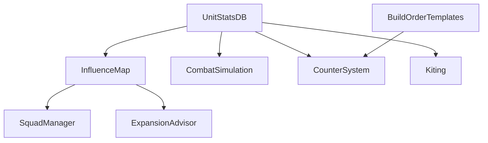

# Expert System Redesign — Design Document

Author: Xi | Date: 2026-04-06 | Status: Draft

> **⚠ Implementation Status (as of 2026-04-06)**
>
> **Nothing in this document has been implemented.** This is a future design
> proposal for Phase 2+ expert improvements. All sections describe target-state
> interfaces and algorithms that do not exist in the codebase yet.
>
> | Section | Status |
> |---|---|
> | §2 InfluenceMap | **NOT IMPLEMENTED** — target-state interface only |
> | §2 UnitStatsDB | **NOT IMPLEMENTED** — target-state interface only |
> | §3 BuildOrderManager | **NOT IMPLEMENTED** — `knowledge.py:OPENING_BUILD_ORDER` exists as static data but no manager/template system |
> | §4 CombatSimulation | **NOT IMPLEMENTED** — target-state interface only |
> | §5 CounterSystem | **NOT IMPLEMENTED** — `knowledge.py:counter_recommendation` exists as static table but no DPS-based scoring |
> | §6 Kiting | **NOT IMPLEMENTED** — target-state interface only |
> | §7 SquadManager | **NOT IMPLEMENTED** — target-state interface only |
> | §8 ExpansionAdvisor | **NOT IMPLEMENTED** — target-state interface only |
>
> **Dependency**: Blocked on Wang review of overall approach. See `docs/xi/plan.md` Queue.

## 1. Current State Summary

Our Expert system has 5 execution experts (Combat, Recon, Economy, Movement, Deploy), 1 information expert (ThreatAssessor), and 1 planner (ProductionAdvisor). Each Expert creates autonomous Jobs that tick on fixed intervals (0.2s–1.0s) and communicate via Signals.

**Key gaps vs mature RTS bots (UAlbertaBot, PurpleWave, OpenRA ModularBot):**

| Capability | Current | Target |
|---|---|---|
| Spatial reasoning | IsExplored grid only | Influence map (threat, value, control) |
| Build order | Static 4-step opening | Template system with scout-driven branching |
| Combat prediction | None (engage on proximity) | DPS-based combat simulation |
| Army counters | Hardcoded threshold table | Dynamic detection → counter production |
| Unit micro | Focus-fire lowest HP | Kiting, stutter-step, focus by priority |
| Strategic planning | LLM decides everything | Rule-based macro planner |

---

## 2. P0 — Influence Map Framework

### 2.1 Motivation

Every advanced decision (safe pathing, defensive placement, expansion scoring, engagement evaluation) requires spatial threat awareness. Currently CombatExpert picks targets by distance alone; ReconExpert scouts blindly without avoiding threat zones; EconomyExpert places buildings without defensibility analysis.

An influence map is the foundational data layer that all other P0–P2 improvements depend on.

### 2.2 Design

#### New file: `experts/influence_map.py`

```python
class InfluenceMap:
    """Grid-based spatial reasoning layer.

    Maintains multiple float grids over the game map, updated at 0.5–1Hz.
    Each grid cell stores a float value representing accumulated influence.
    """

    def __init__(self, width: int, height: int, cell_size: int = 4):
        """
        Args:
            width: Map width in game cells.
            height: Map height in game cells.
            cell_size: Downscale factor. 128x128 map with cell_size=4 → 32x32 grid.
        """
        self.cell_size = cell_size
        self.grid_w = width // cell_size
        self.grid_h = height // cell_size
        # Layer grids: each is a flat list[float] of length grid_w * grid_h
        self.threat: list[float]       # Enemy DPS-weighted presence
        self.value: list[float]        # Friendly unit/building value
        self.control: list[float]      # value - threat (positive = safe)
        self.exploration: list[float]  # Time since last scouted

    def update(self, my_actors: list[dict], enemy_actors: list[dict],
               unit_stats: "UnitStatsDB") -> None:
        """Recompute all layers from current actor positions."""

    def query_threat(self, x: int, y: int) -> float:
        """Threat value at game coordinate (x, y)."""

    def query_control(self, x: int, y: int) -> float:
        """Control value (positive = safe, negative = dangerous)."""

    def safest_path(self, start: tuple, end: tuple) -> list[tuple]:
        """A* pathfinding that avoids high-threat cells."""

    def best_expansion_site(self, ore_fields: list[tuple]) -> tuple:
        """Score ore fields by (resource_value * safety * distance_penalty)."""

    def threat_direction(self) -> Optional[str]:
        """Dominant threat quadrant for strategic decisions."""
```

#### Influence propagation algorithm

Each enemy unit projects threat in a radius based on its weapon range + movement speed:

```
for each enemy unit u:
    dps = unit_stats.get_dps(u.type)
    range = unit_stats.get_range(u.type) + unit_stats.get_speed(u.type) * 3  # 3s projection
    cx, cy = u.position / cell_size
    for each cell (gx, gy) within range:
        dist = manhattan_distance(cx, cy, gx, gy) * cell_size
        falloff = max(0, 1.0 - dist / range)
        threat[gy * grid_w + gx] += dps * falloff
```

Friendly units project value using the same pattern. Control = value - threat.

#### Update frequency

- Threat/value layers: every 1.0s (tied to WorldModel map refresh)
- Exploration layer: updated on each ReconJob tick (marks scouted cells with current time)
- Total cost: ~32x32 grid = 1024 cells, iterate ~50 actors = ~50K operations/update — negligible

#### New file: `experts/unit_stats.py`

```python
@dataclass(frozen=True)
class UnitStats:
    hp: int
    dps: float       # damage per second (primary weapon)
    range: int        # weapon range in game cells
    speed: float      # movement speed (cells/second)
    armor: str        # armor class: "none", "light", "heavy"
    cost: int         # build cost in credits
    build_time: float # seconds to produce

class UnitStatsDB:
    """Static database of RA unit statistics.

    Sourced from OpenRA ra/rules/{infantry,vehicles,structures}.yaml.
    """

    _STATS: dict[str, UnitStats] = {
        "e1":   UnitStats(hp=50,  dps=15,  range=5, speed=1.4, armor="none",  cost=100,  build_time=5),
        "e2":   UnitStats(hp=50,  dps=25,  range=5, speed=1.4, armor="none",  cost=160,  build_time=8),
        "e3":   UnitStats(hp=45,  dps=30,  range=7, speed=1.4, armor="none",  cost=300,  build_time=12),
        "3tnk": UnitStats(hp=400, dps=45,  range=6, speed=3.0, armor="heavy", cost=800,  build_time=24),
        "4tnk": UnitStats(hp=600, dps=60,  range=7, speed=2.5, armor="heavy", cost=1500, build_time=40),
        "v2rl": UnitStats(hp=150, dps=100, range=10,speed=2.8, armor="light", cost=700,  build_time=20),
        "harv": UnitStats(hp=600, dps=0,   range=0, speed=2.0, armor="heavy", cost=1400, build_time=20),
        # ... complete from ra/rules/*.yaml
    }

    def get(self, unit_type: str) -> Optional[UnitStats]: ...
    def get_dps(self, unit_type: str) -> float: ...
    def get_range(self, unit_type: str) -> int: ...
```

#### Integration points

| Consumer | How it uses InfluenceMap |
|---|---|
| **CombatExpert** | Check `control` before engaging. Retreat when threat > 2x value. |
| **ReconExpert** | Avoid cells with threat > threshold. Prefer high-exploration cells. |
| **EconomyExpert** | Score building placement by control value. |
| **ThreatAssessor** | Replace simple enemy_count thresholds with grid-derived threat level. |
| **ProductionAdvisor** | Use threat composition to drive counter-production. |
| **MovementExpert** | `safest_path()` for non-combat movement. |

#### Files modified

| File | Change |
|---|---|
| `experts/influence_map.py` | **New** — InfluenceMap class (~250 lines) |
| `experts/unit_stats.py` | **New** — UnitStatsDB (~150 lines, data-heavy) |
| `world_model/core.py` | Add `InfluenceMap` instance, update in `refresh()`, expose via `query("influence")` |
| `experts/combat.py` | Use `query_control()` for engage/retreat decisions |
| `experts/recon.py` | Use `query_threat()` for threat avoidance in target selection |

**Estimated lines: ~400 new, ~80 modified**

---

## 3. P0 — Build Order Template System

### 3.1 Motivation

Current economy behavior: LLM decides what to build each wake cycle, often producing wrong things (e.g., building a second refinery before barracks when under rush). Mature bots follow deterministic build orders for the first 3-5 minutes, then transition to reactive production.

### 3.2 Design

#### New file: `experts/build_order.py`

```python
@dataclass
class BuildStep:
    unit_type: str        # e.g. "powr", "barr", "proc"
    queue_type: str       # "Building", "Infantry", "Vehicle"
    count: int = 1
    condition: Optional[str] = None  # e.g. "power_plant_count >= 1"
    priority: int = 50

@dataclass
class BuildOrderTemplate:
    name: str             # e.g. "soviet_standard", "soviet_rush_defense"
    faction: str
    steps: list[BuildStep]
    transition_triggers: list["TransitionTrigger"]

@dataclass
class TransitionTrigger:
    """When condition is met, switch to a different template."""
    condition: str        # e.g. "enemy_infantry_count > 6 and elapsed_s < 300"
    target_template: str  # template name to switch to

class BuildOrderManager:
    """Manages build order execution and template switching.

    Integrates with EconomyExpert: instead of LLM deciding each build,
    the manager returns the next step from the active template.
    """

    def __init__(self, templates: dict[str, BuildOrderTemplate]):
        self.templates = templates
        self.active: Optional[BuildOrderTemplate] = None
        self.step_index: int = 0
        self.completed_steps: list[str] = []

    def activate(self, template_name: str) -> None: ...

    def next_step(self, runtime_facts: dict) -> Optional[BuildStep]:
        """Return next build step, or None if template exhausted."""

    def check_transitions(self, runtime_facts: dict, enemy_intel: dict) -> Optional[str]:
        """Check if any transition trigger fires. Returns new template name or None."""

    def is_complete(self) -> bool: ...
```

#### Templates

```python
SOVIET_STANDARD = BuildOrderTemplate(
    name="soviet_standard",
    faction="soviet",
    steps=[
        BuildStep("powr", "Building"),           # 1. Power plant
        BuildStep("barr", "Building"),           # 2. Barracks
        BuildStep("proc", "Building"),           # 3. Refinery
        BuildStep("e1",   "Infantry", count=3),  # 4. 3 riflemen (scout/defense)
        BuildStep("powr", "Building"),           # 5. Second power
        BuildStep("weap", "Building"),           # 6. War factory
        BuildStep("harv", "Vehicle"),            # 7. Second harvester
        BuildStep("proc", "Building"),           # 8. Second refinery
    ],
    transition_triggers=[
        TransitionTrigger("enemy_infantry_count > 6 and elapsed_s < 240", "soviet_rush_defense"),
        TransitionTrigger("enemy_vehicle_count > 3 and elapsed_s < 300", "soviet_anti_vehicle"),
    ],
)

SOVIET_RUSH_DEFENSE = BuildOrderTemplate(
    name="soviet_rush_defense",
    faction="soviet",
    steps=[
        BuildStep("powr", "Building"),
        BuildStep("barr", "Building"),
        BuildStep("e1", "Infantry", count=5),    # More infantry
        BuildStep("ftur", "Defense"),             # Flame tower
        BuildStep("proc", "Building"),
        BuildStep("pbox", "Defense"),             # Pillbox
    ],
    transition_triggers=[],
)

SOVIET_TECH_PUSH = BuildOrderTemplate(
    name="soviet_tech_push",
    faction="soviet",
    steps=[
        BuildStep("powr", "Building"),
        BuildStep("barr", "Building"),
        BuildStep("proc", "Building"),
        BuildStep("weap", "Building"),
        BuildStep("dome", "Building"),           # Radar
        BuildStep("stek", "Building"),           # Tech center
        BuildStep("4tnk", "Vehicle", count=3),   # Mammoth tanks
    ],
    transition_triggers=[],
)
```

#### Integration

The key architectural question: who drives the build order?

**Option A: BuildOrderManager as a new InformationExpert** (recommended)
- Runs in `runtime_facts` computation loop
- Outputs `{"next_build_step": {...}, "build_order_phase": "opening"}` into facts
- LLM/TaskAgent reads `next_build_step` and issues `produce_units` accordingly
- Transition checks run each refresh, reading enemy_intel from runtime_facts

**Option B: EconomyExpert executes build orders directly**
- EconomyExpert gains a `build_order_mode` where it follows template steps
- Removes LLM from production loop entirely during opening
- More reliable but less flexible

Recommend **Option A**: preserves LLM agency (it can override the suggestion), lower blast radius, integrates with existing runtime_facts pipeline.

#### Files modified

| File | Change |
|---|---|
| `experts/build_order.py` | **New** — BuildOrderManager + templates (~300 lines) |
| `experts/knowledge.py` | Move `OPENING_BUILD_ORDER` data into build_order.py |
| `world_model/core.py` | Register BuildOrderManager as InformationExpert, feed enemy_intel |
| `task_agent/agent.py` | SYSTEM_PROMPT: "when next_build_step exists, prefer it over ad-hoc decisions" |

**Estimated lines: ~300 new, ~50 modified**

---

## 4. P1 — Combat Simulation / Prediction

### 4.1 Motivation

CombatExpert currently engages whenever it reaches the target area. No prediction of outcome. Mature bots (SparCraft, UAlbertaBot) simulate fights before committing, avoiding unfavorable engagements.

### 4.2 Design

#### New method in CombatJob or new utility: `experts/combat_sim.py`

```python
@dataclass
class SimResult:
    win_probability: float    # 0.0–1.0
    exchange_ratio: float     # our_remaining_value / their_remaining_value
    estimated_duration_s: float
    our_survivors: int
    their_survivors: int

def simulate_combat(
    our_units: list[dict],    # [{type, hp, dps, armor, ...}]
    their_units: list[dict],
    unit_stats: UnitStatsDB,
    *,
    our_focus_fire: bool = True,
    their_focus_fire: bool = True,
) -> SimResult:
    """Simplified Lanchester-model combat simulation.

    Algorithm:
    1. Compute total DPS for each side (with armor modifiers)
    2. Each timestep (0.5s):
       - Focus fire: all DPS targets lowest-HP enemy
       - Spread fire: DPS distributed evenly
       - Remove dead units
    3. Run until one side eliminated or 30s timeout
    4. Return exchange ratio and estimated outcome
    """
```

#### Armor modifier table

```python
# Damage multiplier: attacker_class → target_armor → multiplier
_ARMOR_MODIFIERS = {
    ("anti_infantry", "none"):  1.5,   # Infantry weapons vs unarmored
    ("anti_infantry", "light"): 0.7,
    ("anti_infantry", "heavy"): 0.3,
    ("anti_armor", "none"):     0.5,
    ("anti_armor", "light"):    1.0,
    ("anti_armor", "heavy"):    1.2,
    ("explosive", "none"):      1.0,
    ("explosive", "light"):     0.8,
    ("explosive", "heavy"):     0.6,
}
```

#### Integration with CombatExpert

```python
# In CombatJob._engage_assault():
sim = simulate_combat(our_units, enemy_units, self._unit_stats)
if sim.exchange_ratio < 0.6:
    # Unfavorable — don't engage, retreat or hold
    self._retreat_to_safe_zone()
    self.emit_signal(kind=SignalKind.RISK_ALERT,
                     summary=f"战力不足(交换比{sim.exchange_ratio:.1f})，撤退")
elif sim.exchange_ratio < 1.0:
    # Close — engage cautiously (harass mode)
    self._engage_harass(actor_ids, enemies, config)
else:
    # Favorable — full assault
    self._engage_assault(actor_ids, enemies)
```

#### Decision thresholds

| Exchange Ratio | Action |
|---|---|
| < 0.3 | Immediate retreat, RISK_ALERT signal |
| 0.3–0.6 | Hold position, don't advance, request reinforcements |
| 0.6–1.0 | Cautious harass engagement |
| > 1.0 | Full assault |
| > 2.0 | Aggressive pursuit enabled |

#### Files modified

| File | Change |
|---|---|
| `experts/combat_sim.py` | **New** — simulate_combat + SimResult (~200 lines) |
| `experts/unit_stats.py` | Add armor modifiers and weapon classes (from P0) |
| `experts/combat.py` | Call simulate_combat before engaging (~30 lines) |

**Estimated lines: ~200 new, ~30 modified**

---

## 5. P1 — Army Composition Counter System

### 5.1 Motivation

Current counter logic in `knowledge.py` is a static table (`counter_recommendation`) with hardcoded percentage thresholds. It cannot adapt to specific compositions (e.g., 3 heavy tanks + 5 infantry needs different response than 10 light tanks).

### 5.2 Design

#### Enhanced counter logic in `experts/planners.py` (ProductionAdvisor)

```python
def _counter_composition(
    self,
    enemy_composition: dict[str, int],  # {unit_type: count}
    unit_stats: UnitStatsDB,
) -> list[dict]:
    """Score each buildable unit against enemy composition.

    For each candidate unit C and each enemy unit E:
      score(C vs E) = dps_effective(C, E.armor) / C.cost * E.count

    Return sorted list of [{unit_type, score, queue_type, reason}].
    """
```

#### Detection pipeline

```
WorldModel.refresh()
  → enemy_actors (with type/name)
  → ThreatAssessor.analyze() → enemy_composition_summary
  → ProductionAdvisor._counter_composition()
  → runtime_facts["counter_recommendation"] = [{unit_type, score, reason}]
  → LLM/TaskAgent reads recommendation and produces accordingly
```

#### Integration with BuildOrderManager

After opening build order completes, ProductionAdvisor takes over production guidance:
- If enemy composition detected → counter-produce
- If no enemy intel → default to balanced army (mix of infantry + vehicles)
- Transition: `build_order_phase: "opening"` → `"reactive"`

#### Files modified

| File | Change |
|---|---|
| `experts/planners.py` | Enhanced `_counter_composition()` method (~80 lines) |
| `experts/info_threat.py` | Output `enemy_composition_by_type: {unit_type: count}` (not just category) |
| `experts/unit_stats.py` | Add weapon_class field to UnitStats |

**Estimated lines: ~100 new, ~30 modified**

---

## 6. P1 — Kiting Micro for CombatExpert

### 6.1 Motivation

Ranged units (V2, rocket soldiers) should attack then retreat during weapon cooldown. Currently all units stand and fight or run away — no stutter-step.

### 6.2 Design

#### New engagement mode or enhancement to existing modes

```python
# In CombatJob, new method:
def _micro_kite(self, actor_id: int, target: dict, unit_stats: UnitStats) -> None:
    """Kiting cycle: attack → move away during cooldown → attack again.

    State machine per unit:
      ATTACK → (weapon fired) → KITE_BACK → (cooldown elapsed) → ATTACK

    Kite direction: away from target, biased toward friendly influence.
    Kite distance: unit.speed * weapon_cooldown_s * 0.8  (stay in range)
    """
```

#### Per-unit state tracking

```python
@dataclass
class UnitMicroState:
    phase: str  # "attack" | "kiting" | "idle"
    last_attack_time: float
    cooldown_s: float  # from unit_stats
    kite_target: Optional[tuple[int, int]]
```

#### Which units kite?

Only units where `range > 4` AND `speed > 1.5` benefit from kiting:
- V2 Rocket Launcher (range=10, speed=2.8) — high value
- Rocket soldiers E3 (range=7, speed=1.4) — borderline, kite vs melee only
- Heavy tanks 3tnk (range=6, speed=3.0) — kite vs short-range infantry

Units that should NOT kite: E1 (range=5, too short), 4tnk (speed=2.5, too slow for its range).

#### Integration

Kiting replaces `_engage_assault` per-unit attack when the unit qualifies. The focus-fire target selection remains the same (lowest HP), but execution alternates attack/move.

#### Files modified

| File | Change |
|---|---|
| `experts/combat.py` | Add `_micro_kite()`, `UnitMicroState`, modify `_engage_assault()` (~120 lines) |
| `experts/unit_stats.py` | Add `cooldown_s` field to UnitStats |

**Estimated lines: ~130 new, ~20 modified**

---

## 7. P2 — Multi-Prong Attack / Squad Splitting

### 7.1 Design sketch

Enhance SURROUND mode with dynamic squad management:

```python
class Squad:
    units: list[int]        # actor_ids
    role: str               # "main", "flank_left", "flank_right", "reserve"
    waypoint: tuple[int, int]
    status: str             # "moving", "engaging", "retreating"

class SquadManager:
    def split_into_squads(self, actor_ids: list[int], target: tuple,
                          threat_map: InfluenceMap) -> list[Squad]:
        """Split army into 2-3 squads based on:
        - Main force (60%): direct approach
        - Flank (30%): approach from low-threat side
        - Reserve (10%): hold back for reinforcement
        """
```

Depends on: InfluenceMap (P0) for threat-aware flank routing.

**Estimated lines: ~200 new**

---

## 8. P2 — Expansion Timing Decision

### 8.1 Design sketch

New InformationExpert that outputs expansion recommendations:

```python
class ExpansionAdvisor:
    def analyze(self, runtime_facts, *, ore_fields, influence_map) -> dict:
        """
        Recommend expansion when:
        1. Harvester saturation > 80% on current refineries
        2. Cash income < production drain
        3. A safe ore field exists (control > threshold)

        Output: {"should_expand": bool, "best_site": (x, y), "reason": str}
        """
```

Depends on: InfluenceMap (P0) for site safety scoring, ore field tracking from map query.

**Estimated lines: ~100 new**

---

## 9. Implementation Order

Dependencies dictate sequencing:

```
Phase 1 (foundation):
  P0-1: UnitStatsDB        ← no dependencies, pure data
  P0-2: InfluenceMap        ← depends on UnitStatsDB
  P0-3: BuildOrderTemplates ← no dependencies

Phase 2 (consumers):
  P1-1: CombatSimulation    ← depends on UnitStatsDB
  P1-2: CounterSystem       ← depends on UnitStatsDB + ThreatAssessor
  P1-3: Kiting              ← depends on UnitStatsDB

Phase 3 (advanced):
  P2-1: SquadManager        ← depends on InfluenceMap
  P2-2: ExpansionAdvisor    ← depends on InfluenceMap
```



### Estimated total effort

| Component | New lines | Modified lines |
|---|---|---|
| UnitStatsDB | 150 | 0 |
| InfluenceMap | 250 | 80 |
| BuildOrderManager | 300 | 50 |
| CombatSimulation | 200 | 30 |
| CounterSystem | 100 | 30 |
| Kiting | 130 | 20 |
| SquadManager | 200 | 40 |
| ExpansionAdvisor | 100 | 20 |
| **Total** | **~1430** | **~270** |

---

## 10. Risk Assessment

| Risk | Mitigation |
|---|---|
| UnitStats data inaccuracy | Cross-validate against OpenRA ra/rules/*.yaml at implementation time |
| InfluenceMap perf on large maps | 4x downscale (128→32 grid), 1Hz update, profile before optimizing |
| Build order too rigid | Transition triggers + LLM override ("when next_build_step exists, prefer it" not "must follow it") |
| Combat sim inaccurate | Conservative thresholds (0.6 not 0.5), sim is advisory not mandatory |
| Kiting bugs in tight spaces | Only enable for units with sufficient range/speed ratio, disable near buildings |

---

## 11. Non-Goals

- **Machine learning / RL**: Not in scope. All logic is rule-based and transparent.
- **Replays / opponent modeling**: Not in scope. React to what we see, don't predict from history.
- **Full unit pathfinding**: OpenRA handles pathing. We only need high-level waypoint routing via InfluenceMap.
- **Alliance/diplomacy**: Single-player vs AI only for now.
